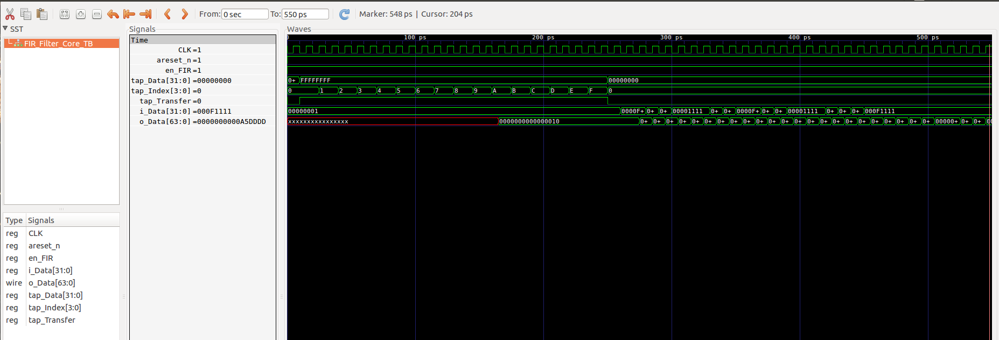

<h2><b>Reconfigurable FIR Filter</b></h2>

A reconfigurable Finite Impulse Response (FIR) Filter core for Field Programmable Gate Arrays (FPGA) is written in Verilog Language. Testbench is written in SystemVerilog and will be updated in upcoming updates. <br>

FIR Filter is a popular Digital Signal Processing (DSP) application. It is a digital filter that has finite impulse response which means duration is finite. Every input value is multiplied by defined filter coefficients and buffered before driven through the output.<br>

Filter coefficients can be obtained and filter specifications can be visualised by using Octave, MATLAB or other software. <br>

<h2><b>Ports</b></h2>

| Port Name  | Width | Description |
| :-----------: | :------------: | :------------: |
| CLK  | 1 bit  | Clock Input. |
| areset_n  | 1 bit  | Asynchronous negative reset.|
| en_FIR  | 1 bit  | Enable filtering. |
| tap_Transfer  | 1 bit  | Load filter coefficients. |
| tap_Index  | 4 bits  | Index of tap. |
| tap_Value  | 32 bits  | Value of tap. |
| i_Data  | 32 bits  | Filter input. |
| o_Data  | 64 bits  | Filter output. |

<ul>
    <li><b>areset_n</b> is always <b>HIGH</b>. When it is <b>LOW</b>, core gets a reset.</li>
    <li><b>en_FIR</b> input must be <b>HIGH</b> for incoming data gets filtered at output.</li>
    <li><b>tap_Transfer</b> input must be <b>HIGH</b> if filter coefficients are getting updated.</li>
    <li><b>tap_Index</b> points coefficient order while writing coefficients into core.</li>
    <li><b>tap_Value</b> is coefficient value to write into core. Fixed point values are written.</li>
    <li><b>i_Data</b> input is connected to slave AXI-Stream interface. 32 bits of data stream read at this port.</li>
    <li><b>o_Data</b> output is connected to master AXI-Stream interface. 64 bits of data stream is written to this port. 32 bits input data is processed as 64 bits data at output since arithmatic operations(multiplication) held in core.</li>
</ul>

<h2><b>Load Filter Coefficients</b></h2>

When <b>tap_Transfer</b> is asserted <b>HIGH</b>, the FIR Filter core waits for tap index and value. <b>tap_Transfer</b> input must be <b>HIGH</b> while loading taps to filter. The last value written to tap is kept inside tap registers in core.

A finite state machine (FSM) is used to load filter coefficients inside FIR Filter core. In current version, no initial coefficients are loaded. Therefore, 15 coefficients must be loaded at initialization process.

<h2><b>Simulation Outputs</b></h2>

FIR Filter core is tested in Icarus Verilog and testbench outputs are observed on GTKWave. In order to run the testbench in Icarus Verilog run following commands in your terminal.<br>

```
> iverilog -o FIR_Filter.vvp FIR_Filter_Core_TB.sv
> vvp FIR_Filter.vvp
```

A file named "FIR_Filter.vcd" will be created into your directory consisting simulation outputs. This file can be opened using GTKWave. Simulation output is shown in following figure.<br>



<br><br><br>

<h3><b>Upcoming Updates</b></h3>

<p>
<ol>
    <li> AXI-Lite and AXI-Stream interfaces will be added. </li>
    <li> Mapped Memory will consist 1 control/status register. </li>
    <li> Coefficients will be written to AXI-Lite mapped memory. </li>
</ol>
</p>


